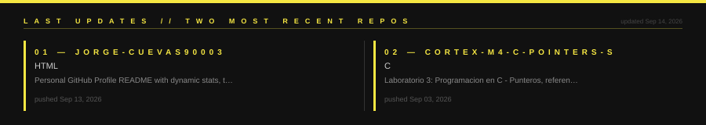

<div align="center">


</div>

---

<div align="center">


</div>

---

<div align="center">


</div>

---

<div align="center">



</div>

---

<div align="center">

[](https://jorge-cuevas90003.github.io)&nbsp;&nbsp;
[](mailto:jorge@example.com)&nbsp;&nbsp;
[](https://github.com/Jorge-Cuevas90003)

</div>

---

<div align="center">

```
SYSTEM: JORGE CUEVAS // CS STUDENT // BUILDER // SOLVER
LAST COMMIT: bd4d7c1 — Jorge-Cuevas90003.github.io · Jun 14, 2026
STATUS: ONLINE — ACCEPTING COLLABORATIONS
```

</div>
